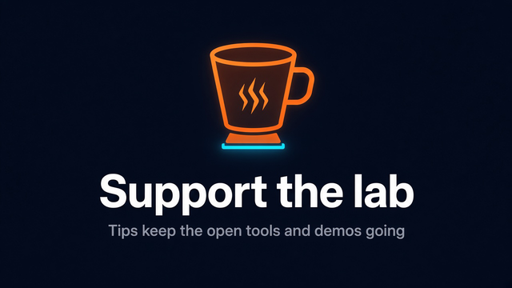

# SMF Works

A map of what [SMF Works](https://github.com/smfworks) publishes on GitHub — what to use, what is experimental, what is only a fork mirror, and what is archived.

Surveyed **2026-09-16** against the public `smfworks` account (**76** public repositories). This file is an index, not a product pitch.

## Try these (viral apps)

Eight MIT, client-side apps — no account, no backend. They form a small kit: **create a skill → lint it → present it as a card → diff the rewrite → stamp a proposed action → declare allowed tools → print a receipt → scrub secrets.**

| App | What it does | Live demo | Repo |
|---|---|---|---|
| **Paste → Skill** | Paste an SOP or notes → Hermes/OpenClaw `SKILL.md` | **[paste-to-skill.vercel.app](https://paste-to-skill.vercel.app)** | [paste-to-skill](https://github.com/smfworks/paste-to-skill) |
| **Skill Lint** | Green / yellow / red `SKILL.md` report card with fix hints | **[skill-lint.vercel.app](https://skill-lint.vercel.app)** | [skill-lint](https://github.com/smfworks/skill-lint) |
| **Skill Card** | Paste a `SKILL.md` → pretty shareable one-pager PNG | **[skill-card-theta.vercel.app](https://skill-card-theta.vercel.app)** | [skill-card](https://github.com/smfworks/skill-card) |
| **Prompt Diff** | Paste two prompts → visual shareable diff | **[prompt-diff-eight.vercel.app](https://prompt-diff-eight.vercel.app)** | [prompt-diff](https://github.com/smfworks/prompt-diff) |
| **Refuse Card** | `GO` / `HOLD` / `NO` stamp for a proposed agent action | **[refuse-card.vercel.app](https://refuse-card.vercel.app)** | [refuse-card](https://github.com/smfworks/refuse-card) |
| **Tool Permit** | Declare allowed tools → shareable allowlist / `PERMIT` badge (GO-list twin of Refuse Card) | **[tool-permit.vercel.app](https://tool-permit.vercel.app)** | [tool-permit](https://github.com/smfworks/tool-permit) |
| **Agent Receipt** | Turn any agent session into a dark shareable receipt card | **[agent-receipt-green.vercel.app](https://agent-receipt-green.vercel.app)** | [agent-receipt](https://github.com/smfworks/agent-receipt) |
| **Redact Before Share** | Paste a transcript → scrub secrets/PII → clean export + removal receipt (pairs with Agent Receipt) | **[redact-before-share.vercel.app](https://redact-before-share.vercel.app)** | [redact-before-share](https://github.com/smfworks/redact-before-share) |

## Support the lab

If a demo or note from this map was useful, a voluntary tip helps keep the lab’s MIT-licensed open tools, viral demos, and public write-ups going. That includes Paste → Skill, Skill Lint, Skill Card, Prompt Diff, Refuse Card, Tool Permit, Agent Receipt, and Redact Before Share, plus the clone-first repos and essays on [The Clearinghouse Log](https://www.smfclearinghouse.com/blog/). This is a tip jar, not a product purchase, and it is not Agent Setup — no account, no obligation.

**[Support SMF Works →](https://donate.stripe.com/14A6oGbHv3hHekY2ODew801)**

## What SMF Works is

SMF Works is a small human–AI lab (Pittsboro, NC) that publishes tools, write-ups, and experiments around **local and hybrid agents** — especially [Hermes Agent](https://github.com/NousResearch/hermes-agent), [OpenClaw](https://github.com/openclaw/openclaw), and Linux/[Omarchy](https://github.com/omacom/omarchy) setups. The brand site is [smfworks.com](https://smfworks.com). Practitioner notes live on [The Clearinghouse Log](https://www.smfclearinghouse.com/blog/). **This account does not own Omarchy, Hermes Agent, or OpenClaw.** Those projects belong to their upstream authors; our copies of them are mirrors only.

## Start here

| If you care about… | Start with | Then |
|---|---|---|
| **Omarchy + Hermes on a machine** | [hermes-omarchy](https://github.com/smfworks/hermes-omarchy) — boot integration (Ollama user unit, Hermes desktop autostart, skills/plugin wiring) | [smf-hermes](https://github.com/smfworks/smf-hermes) — optional Omarchy bar widget (`smf.hermes`). Upstream desktop: [omacom/omarchy](https://github.com/omacom/omarchy) |
| **Hermes as a team** | [hermes-ai-team](https://github.com/smfworks/hermes-ai-team) — highest-interest SMF repo; agent-consumable guide from one install to named colleagues | Companion essay: [Building an AI team…](https://www.smfclearinghouse.com/blog/building-an-ai-team-from-installation-to-colleagues). Upstream agent: [NousResearch/hermes-agent](https://github.com/NousResearch/hermes-agent). Lofoten plugins: [hermes-lofoten-challenge](https://github.com/smfworks/hermes-lofoten-challenge) catalog (see [experimental](#lofoten-sprint)) |
| **OpenClaw** | [smfworks-skills](https://github.com/smfworks/smfworks-skills) — small-business OpenClaw skills | [smf-openclaw-vision](https://github.com/smfworks/smf-openclaw-vision) (iPhone/RTSP eyes), [mnemosyne-openclaw](https://github.com/smfworks/mnemosyne-openclaw) (offline SQLite memory). Upstream: [openclaw/openclaw](https://github.com/openclaw/openclaw) |
| **Evals / trajectories** | [smf-bench](https://github.com/smfworks/smf-bench) — capability-gated model suite | [trajectory-arena](https://github.com/smfworks/trajectory-arena) (import/replay agentic coding traces; does not run agents). Related notes: [NemoKnowledgebase](https://github.com/smfworks/NemoKnowledgebase) |

## Supported

SMF-authored repos that are the intended public surface for a given job. “Supported” here means *this is the one to clone first* — not a support contract. For the browser kit, prefer the [live demos](#try-these-viral-apps).

### Browser kit

MIT, client-side. Try in the browser; clone only if you want the source.

| Repo | What it is |
|---|---|
| [paste-to-skill](https://github.com/smfworks/paste-to-skill) | Paste SOP/notes → Hermes/OpenClaw `SKILL.md`. Demo: [paste-to-skill.vercel.app](https://paste-to-skill.vercel.app) |
| [skill-lint](https://github.com/smfworks/skill-lint) | Green/yellow/red `SKILL.md` report with fix hints. Demo: [skill-lint.vercel.app](https://skill-lint.vercel.app) |
| [skill-card](https://github.com/smfworks/skill-card) | Paste `SKILL.md` → pretty shareable one-pager PNG. Demo: [skill-card-theta.vercel.app](https://skill-card-theta.vercel.app) |
| [prompt-diff](https://github.com/smfworks/prompt-diff) | Paste two prompts → visual shareable diff. Demo: [prompt-diff-eight.vercel.app](https://prompt-diff-eight.vercel.app) |
| [refuse-card](https://github.com/smfworks/refuse-card) | GO / HOLD / NO stamp for a proposed agent action. Demo: [refuse-card.vercel.app](https://refuse-card.vercel.app) |
| [tool-permit](https://github.com/smfworks/tool-permit) | Declare allowed tools → shareable allowlist / PERMIT badge (GO-list twin of Refuse Card). Demo: [tool-permit.vercel.app](https://tool-permit.vercel.app) |
| [agent-receipt](https://github.com/smfworks/agent-receipt) | Dark shareable receipt card of an agent session. Demo: [agent-receipt-green.vercel.app](https://agent-receipt-green.vercel.app) |
| [redact-before-share](https://github.com/smfworks/redact-before-share) | Paste transcript → scrub secrets/PII → clean export + removal receipt (pairs with Agent Receipt). Demo: [redact-before-share.vercel.app](https://redact-before-share.vercel.app) |

### Clone first

| Repo | What it is |
|---|---|
| [hermes-ai-team](https://github.com/smfworks/hermes-ai-team) | Phase-by-phase guide to turn a Hermes install into a team (SOUL, memory, vault, skills, rituals, Desktop Bots). |
| [hermes-omarchy](https://github.com/smfworks/hermes-omarchy) | Reusable Hermes ↔ Omarchy boot integration. |
| [smf-hermes](https://github.com/smfworks/smf-hermes) | Omarchy shell plugin: Hermes on the bar (`id smf.hermes`). |
| [smfworks-skills](https://github.com/smfworks/smfworks-skills) | OpenClaw skills collection (install via the repo’s CLI / TUI). |
| [smf-openclaw-vision](https://github.com/smfworks/smf-openclaw-vision) | Give an OpenClaw agent camera/RTSP vision (v1, iPhone-oriented). |
| [mnemosyne-openclaw](https://github.com/smfworks/mnemosyne-openclaw) | Offline local SQLite memory plugin for OpenClaw (FTS5, no network). |
| [smf-ai-bridge](https://github.com/smfworks/smf-ai-bridge) | On-machine Linux message bus between OpenClaw and Hermes agents. |
| [lar-agent-resilience](https://github.com/smfworks/lar-agent-resilience) | Reference implementation for resilient agent design on Linux. |
| [smf-bench](https://github.com/smfworks/smf-bench) | Owned, capability-gated LLM / multimodal benchmark harness. |
| [trajectory-arena](https://github.com/smfworks/trajectory-arena) | Local-first visualizer/evaluator for imported agentic coding trajectories. |

## Useful experimental

Expect rough edges, overlapping ideas, and READMEs that may be ahead of the code. Useful if you already know the stack.

### Agent infra and products

| Repo | Notes |
|---|---|
| [smf-praxis](https://github.com/smfworks/smf-praxis) | Governed autonomous colleague (early preview). |
| [smf-swarm-2.0](https://github.com/smfworks/smf-swarm-2.0) | Current Swarm: governance-first multi-persona analysis. Commercial verticals are private. |
| [smf-swarm](https://github.com/smfworks/smf-swarm) | Swarm v1 — **legacy / maintenance**. Prefer 2.0. |
| [smf-forgewright](https://github.com/smfworks/smf-forgewright) | Browser-automation + SkillOpt-style tuning workbench for agents. |
| [smf-multi-agent-orchestration-CLI](https://github.com/smfworks/smf-multi-agent-orchestration-CLI) | YAML-composed agent pipelines from the terminal. |
| [smf-clawless-orchestrator](https://github.com/smfworks/smf-clawless-orchestrator) | Hybrid OpenClaw + Hermes supervisor / swarm experiment. |
| [m365-access-broker](https://github.com/smfworks/m365-access-broker) | Local control plane that gates Microsoft Graph actions (allowlists, approvals, audit). |
| [spark-observatory](https://github.com/smfworks/spark-observatory) | Live DGX Spark ops wall (sparkDash telemetry). |
| [smf-hermes-chat-hub](https://github.com/smfworks/smf-hermes-chat-hub) | Browser chat hub for Hermes profiles (Tailscale-friendly). |
| [skillopt](https://github.com/smfworks/skillopt) | Skill-text optimizer (family also includes [skillopt-content](https://github.com/smfworks/skillopt-content), [smf-SkillTrain](https://github.com/smfworks/smf-SkillTrain)). |

### Lofoten sprint

Hermes plugins and skills from the 2026-08 Lofoten challenge. The curated map is [hermes-lofoten-challenge](https://github.com/smfworks/hermes-lofoten-challenge). Treat siblings as experimental and read each README before installing.

| Repo | Stated role |
|---|---|
| [hermes-lofoten-challenge](https://github.com/smfworks/hermes-lofoten-challenge) | Public catalog of the Lofoten-sprint skills and plugins |
| [lofoten-challenge](https://github.com/smfworks/lofoten-challenge) | Fleet coordination / session analytics / discovery |
| [hermes-plugin-harbor](https://github.com/smfworks/hermes-plugin-harbor) | Solo / pair / swarm collaboration router |
| [hermes-plugin-hybrid-routing](https://github.com/smfworks/hermes-plugin-hybrid-routing) | Sensitivity / role / difficulty model routing |
| [hermes-plugin-maelstrom-gate](https://github.com/smfworks/hermes-plugin-maelstrom-gate) | Quality / lint gate |
| [hermes-plugin-stockfish-packet](https://github.com/smfworks/hermes-plugin-stockfish-packet) | Research / citations packet |
| [hermes-plugin-fjord-audit](https://github.com/smfworks/hermes-plugin-fjord-audit) | Audit plugin |
| [hermes-skill-resilience-harness](https://github.com/smfworks/hermes-skill-resilience-harness) | Trajectory eval, oppositional testing, recovery |
| [hermes-skill-saga-memory](https://github.com/smfworks/hermes-skill-saga-memory) | Narrative / place-based memory skill |
| [hermes-extension-forge](https://github.com/smfworks/hermes-extension-forge) | Governed skill/plugin publishing helpers |

Related UI **mocks** (in-process fake data; they do not attach to a live Hermes): [hermes-skill-forge](https://github.com/smfworks/hermes-skill-forge), [hermes-mission-control](https://github.com/smfworks/hermes-mission-control).

### Demos

| Repo | Notes |
|---|---|
| [flybrain-visual-demos](https://github.com/smfworks/flybrain-visual-demos) | Visual *Drosophila* connectome demos. Public repo; live host: [flybrain.aionasmfworks.com](https://flybrain.aionasmfworks.com). Connectome data is HHMI Janelia FlyEM / collaborators — this repo is demo code only. |

### Also published (long tail)

Not ranked. Many are older, Windows-only, or empty of a GitHub description. Clone only if the name matches a job you already have.

[NemoKnowledgebase](https://github.com/smfworks/NemoKnowledgebase) ·
[smf-notebooklm-video-pipeline](https://github.com/smfworks/smf-notebooklm-video-pipeline) ·
[smf-vision](https://github.com/smfworks/smf-vision) ·
[SMF-SEO](https://github.com/smfworks/SMF-SEO) ·
[smf-clawpost](https://github.com/smfworks/smf-clawpost) ·
[smf-llm-test](https://github.com/smfworks/smf-llm-test) ·
[smf-cadwright](https://github.com/smfworks/smf-cadwright) ·
[smf-kalshi-trader](https://github.com/smfworks/smf-kalshi-trader) ·
[smf-sparkforge](https://github.com/smfworks/smf-sparkforge) ·
[ForgeVault](https://github.com/smfworks/ForgeVault) ·
[openclaw-windows-companion-app](https://github.com/smfworks/openclaw-windows-companion-app) ·
[wisdomforge-kids-Hermes-profiles](https://github.com/smfworks/wisdomforge-kids-Hermes-profiles) ·
[Hermes-convergence-work](https://github.com/smfworks/Hermes-convergence-work) ·
[smf-project-forge](https://github.com/smfworks/smf-project-forge) ·
[smf-chat](https://github.com/smfworks/smf-chat) ·
[smf-simple-cms](https://github.com/smfworks/smf-simple-cms) ·
[smf-lead-capture](https://github.com/smfworks/smf-lead-capture) ·
[smf-webcam-capture](https://github.com/smfworks/smf-webcam-capture) ·
[shipped](https://github.com/smfworks/shipped) ·
[book-architecture-of-taste](https://github.com/smfworks/book-architecture-of-taste)

Full account listing: [github.com/smfworks?tab=repositories](https://github.com/smfworks?tab=repositories).

## Fork mirrors

Pointers only. **Use the upstream repo** unless you have a reason to inspect this copy. SMF does not claim authorship of these projects.

| Mirror here | Upstream (use this) |
|---|---|
| [omarchy](https://github.com/smfworks/omarchy) | [omacom/omarchy](https://github.com/omacom/omarchy) — [omarchy.org](https://omarchy.org) |
| [hermes-agent](https://github.com/smfworks/hermes-agent) | [NousResearch/hermes-agent](https://github.com/NousResearch/hermes-agent) — [hermes-agent.nousresearch.com](https://hermes-agent.nousresearch.com) |
| [hermes-agent-self-evolution](https://github.com/smfworks/hermes-agent-self-evolution) | [NousResearch/hermes-agent-self-evolution](https://github.com/NousResearch/hermes-agent-self-evolution) |
| [openclaw](https://github.com/smfworks/openclaw) | [openclaw/openclaw](https://github.com/openclaw/openclaw) — [openclaw.ai](https://openclaw.ai) |
| [Personal-AI-Router](https://github.com/smfworks/Personal-AI-Router) | [NVIDIA/Personal-AI-Router](https://github.com/NVIDIA/Personal-AI-Router) |
| [model-serving-minefield](https://github.com/smfworks/model-serving-minefield) | [Blackwellboy/model-serving-minefield](https://github.com/Blackwellboy/model-serving-minefield) |
| [smf-windows-hermes](https://github.com/smfworks/smf-windows-hermes) | [aivrar/portable-hermes-agent](https://github.com/aivrar/portable-hermes-agent) |
| [smf_blackbox_node](https://github.com/smfworks/smf_blackbox_node) | [wadadawadada/blackbox_node](https://github.com/wadadawadada/blackbox_node) |
| [hyperframes](https://github.com/smfworks/hyperframes) | [heygen-com/hyperframes](https://github.com/heygen-com/hyperframes) |

## Sites

Code for public sites. Prefer the **live URL** over a Vercel preview hostname when both exist.

| Repo | Live URL | Notes |
|---|---|---|
| [smfworks-site](https://github.com/smfworks/smfworks-site) | [smfworks.com](https://smfworks.com) | Brand / parent site. Not a substitute for this GitHub map. |
| [aiclearinghouse-site](https://github.com/smfworks/aiclearinghouse-site) | [smfclearinghouse.com](https://www.smfclearinghouse.com/) · [blog](https://www.smfclearinghouse.com/blog/) | Practitioner site and The Clearinghouse Log. Repo homepage still lists a Vercel preview. |
| [smfwisdomforge-site](https://github.com/smfworks/smfwisdomforge-site) | [smfwisdomforge.com](https://www.smfwisdomforge.com) | WisdomForge marketing site. |
| [wisdomforge](https://github.com/smfworks/wisdomforge) | [smfwisdomforge.com](https://www.smfwisdomforge.com) | Parent-operated academy app (repo homepage is a Vercel preview). |
| [phoenixprotocolml](https://github.com/smfworks/phoenixprotocolml) | [phoenixprotocolml.com](https://phoenixprotocolml.com) | Separate project site (Morgan Lockridge / SMF). |

## Archived

Left archived on purpose. Do not treat these as current products.

| Repo | Notes |
|---|---|
| [smf-dashboard](https://github.com/smfworks/smf-dashboard) | Former OpenClaw agent dashboard. Read-only. |
| [smf-social-v2](https://github.com/smfworks/smf-social-v2) | Former social automation tree. No GitHub description. |

## How to read this account

- **GitHub listing:** [github.com/smfworks](https://github.com/smfworks). The account type on GitHub is `User`, with public repos under that login.
- **Writing vs code:** essays and lab notes → [Clearinghouse Log](https://www.smfclearinghouse.com/blog/). Clone targets → tables above.
- **Dead personal account:** older docs pointed at `mikesmoltbot-hub`. That user is gone (404). Use `smfworks` only.
- **Licenses:** per-repo. Forks keep upstream licenses. This index repository has no license file.

Corrections to the map are welcome via pull request on this repo.
